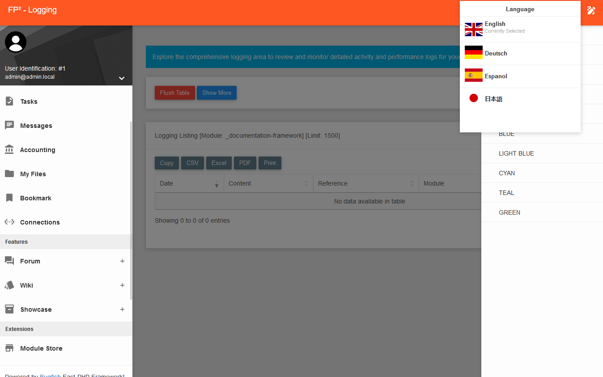
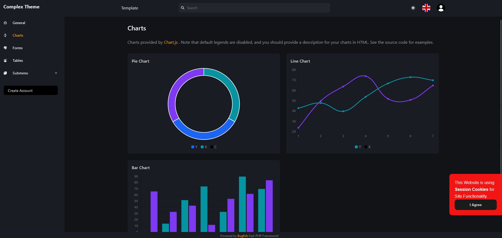

# bugfishCMS

## Introduction
bugfishCMS is a powerful and versatile content management system designed to empower both end-users and developers alike. Whether you're a business owner looking to streamline your online presence or a developer seeking robust backend functionalities, bugfishCMS has you covered.

With bugfishCMS, you can effortlessly manage user permissions, debug your websites for optimal performance, and customize the administrator interface to suit your preferences. Enjoy multi-language support, dynamic color schemes, and a simplified installation process with our intuitive GUI installer.

For developers, bugfishCMS offers a comprehensive suite of backend features, including multi-site management, framework integration, debugging tools, and dynamic code loading capabilities. Seamlessly integrate with our Bugfish Framework and leverage ready-to-use updater routines for effortless project maintenance.

Explore our extension store for additional functionalities, manage files and media assets with ease, and harness integrated CRM tools.

## Features

### End-User Features

| **Feature**                | **Description**                                                                                                                                             |
|----------------------------|-------------------------------------------------------------------------------------------------------------------------------------------------------------|
| Administrator Module        | Responsive backend with file, user management, debugging insights, and access to the extension store.                                                       |
| User and Group Manager      | Organize users into groups for streamlined access control, with permission management.                                                                      |
| Installer                   | Simplified installation process with a graphical user interface (GUI).                                                                                      |
| Updater                     | GUI-based updater for easy maintenance of the CMS.                                                                                                          |
| File Management             | Robust file management for uploading and organizing media assets.                                                                                           |
| Extension and Dedicated Store| Centralized marketplace for discovering, installing, and managing extensions, including setting up an extension store.                                      |
| Store System and Module Downloads | Fully functional store system for module downloads, enhancing website customization.                                                                 |
| Notification System         | System notifications for events and changes.                                                                                                               |
| Docker Control              | Integrated control of Docker containers within the CMS for advanced deployment flexibility.                                                                 |

### Developer Features

| **Feature**                 | **Description**                                                                                                                                             |
|-----------------------------|-------------------------------------------------------------------------------------------------------------------------------------------------------------|
| Multi-Site Management        | Centralized management of multiple websites.                                                                                                               |
| Framework Integration        | Integration with Bugfish Framework for bug tracking and debugging with support for CSS, JavaScript, and PHP Libraries.                                      |
| Debugging Tools              | Robust debugging tools to identify errors and test performance or SQL issues.                                                                               |
| Multi-Language Support       | Manage multiple languages for a global audience.                                                                                                           |
| Dynamic Themes and Colors    | Enable dynamic switching of themes and color adjustments.                                                                                                  |
| Dynamic CSS/JS Load          | Dynamically load CSS and JavaScript files for optimized performance.                                                                                        |
| Updater Backend              | Ready-to-use updater routines per Site Module.                                                                                                             |
| Dynamic Code Loading         | Support dynamic loading of code snippets or scripts.                                                                                                       |
| Dynamic Cronjobs             | Schedule and automate tasks with dynamic cronjobs.                                                                                                         |
| Extension Support            | Extend modules with custom or store-downloaded extensions.                                                                                                 |
| Deployment                   | Deploy and control bugfishCMS clusters, module updates, and core updates via a public store.                                                               |
| Integrated Templates         | Pre-designed templates for simplified website design.                                                                                                      |
| Example Modules              | Collection of example modules for reference and inspiration.                                                                                               |
| Developer-Friendly Interface | Comprehensive interface for developers to access and customize the system.                                                                                 |

For more features and detailed information, check the `docs` folder. Please note, that this documentation is for developers. The Youtube Tutorial Videos will give you more Insights about the End-User Functionalities. See "Documentation Links" sections for more information about these videos.

## Screenshots
    

## Official Store

👉 Visit the [bugfishCMS Store](https://store.bugfish.eu) for more info and available modules! You can extend the functionality of bugfishCMS by adding scripts, extensions and modules!

## Installation
For Installation Information please see our documentation at the _docs folder of this repository or at https://bugfishtm.github.io/bugfish-cms.

## Docker

There may be a Docker image available for this project on my Docker Hub account:
[Docker Hub - bugfishtm](https://hub.docker.com/u/bugfishtm)

## Repository Structure
You can find README.md files in this repositories subfolders which will explain what the different folders do. Also you can get insights about CMS and Module Folder structures in the _source/README.md file.

Below is information about the folder and file structure of this repository:
| Folder      | Description                         |
| ----------- | ----------------------------------- |
| .github     | Github Related Internal Files  |
| _images   | Some images about this project used in readme. |
| _licenses   | Licenses of included 3rd Party Libraries.     | 
| _examples     | Example CMS Modules to be explored. |
| _releases   | Releases of bugfishCMS |
| _changelogs   | Changelogs of bugfishCMS |
| _source     | Source Code to be uploaded to your website root directory if you want to use this software. |
| docs        | Documentation about bugfishCMS |
|.gitattributes | Internal file for this repository |
|.gitignore | Internal file for this repository |
|CHANGELOG.md | Information for Changelogs |
|CONTRIBUTING.md | Information for Contribution |
| LICENSE.md | Includes the GPLv3 license for this project |
| README.md | The file you are currently reading |

## Documentation Links
You can find documentation about the project on links below. This documentation is mostly for developers, if you are an end customer your are invited to watch our youtube tutorial playlist, which will give you insights about some functionalities and frontend features.
- [CMS Documentation](https://bugfishtm.github.io/bugfish-cms/)
- [Framework Documentation](https://bugfishtm.github.io/bugfish-framework/)
- [Tutorial Videos](https://www.youtube.com/playlist?list=PL6npOHuBGrpAfrpUzQPTOWdqoCnhq1oP0)

## Support
Should you encounter any issues or have questions while using this software, please do not hesitate to reach out to us.
- [Bugfish Forum](www.bugfish.eu/forum)
- [Mail Support](mailto:request@bugfish.eu)
- [Github Issues](https://github.com/bugfishtm/bugfish-cms/issues)

## Licensing Information

View LICENSE.MD or _licenses folder inside this folder to see which 3rd party scripts have been used and which external templates and functionalities have been implemented. Take care to respect every single license.

