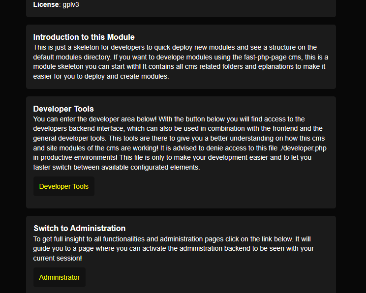
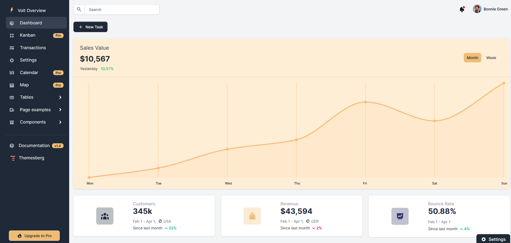

# Themes

Below a list of internal core functions, which may come in handy in development. They are here to fast use internal themes of this CMS to work with and create your website as you need it. The use of this functions are optional and if you are not using this PHP-Themes at all, you can ignore this functions! You can easily build full resposive websites with site modules using this pre-defined dashboard and styling functionalities!

## Simple Theme

The Simple Theme is designed to quickly build basic websites with minimal configuration. Below is the documentation for the available functions in this theme.

For further customization and a deeper understanding of the template, you can check out the [Responsive Mail Template on GitHub](https://github.com/leemunroe/responsive-html-email-template). 

 

### Functions Overview

| Function             | Description                                           | Parameters                                                                 |
|----------------------|-------------------------------------------------------|----------------------------------------------------------------------------|
| `hive__simple_start` | Initializes the HTML structure for a webpage with necessary meta tags and styles. | - `$object` (required): Represents an object.  - `$tabtitle` (optional): Title of the tab (default: empty string).  - `$metaextensions` (optional): Additional meta extensions (default: empty string). |
| `hive__simple_end`   | Completes the HTML structure for a webpage, specifically adding the footer section. | - `$object` (required): Represents an object.  - `$footer` (optional): Footer content (default: empty string). |

## Windmill Theme

The Windmill TailwindCSS Theme is a responsive and advanced theme that provides various functionalities and styling options. This documentation provides a comprehensive guide to the functions available in the Windmill theme.

 

### Functions Overview

#### Alert Boxes

| Function | Description | Parameters |
|----------|-------------|------------|
| `hive__windmill_alert_danger($message, $classes)` | Generates a danger alert box. | `$message` (string), `$classes` (string, optional) |
| `hive__windmill_alert_success($message, $classes)` | Generates a success alert box. | `$message` (string), `$classes` (string, optional) |
| `hive__windmill_alert_warning($message, $classes)` | Generates a warning alert box. | `$message` (string), `$classes` (string, optional) |
| `hive__windmill_alert_info($message, $classes)` | Generates an info alert box. | `$message` (string), `$classes` (string, optional) |
| `hive__windmill_alert_primary($message, $classes)` | Generates a primary alert box. | `$message` (string), `$classes` (string, optional) |
| `hive__windmill_alert_url($message, $image, $url, $newtab, $rel, $more, $classes)` | Generates an alert box with a link. | `$message` (string), `$image` (string), `$url` (string), `$newtab` (boolean), `$rel` (boolean), `$more` (string, optional), `$classes` (string) |

#### Heading Elements

| Function | Description | Parameters |
|----------|-------------|------------|
| `hive__windmill_h2($text, $classes)` | Generates an h2 heading element. | `$text` (string), `$classes` (string, optional) |
| `hive__windmill_h4($text, $classes)` | Generates an h4 heading element. | `$text` (string), `$classes` (string, optional) |

#### Button Elements

| Function | Description | Parameters |
|----------|-------------|------------|
| `hive__windmill_button($text, $icon, $color, $tcolor, $type, $url, $name, $js, $classes)` | Generates a button element. | `$text` (string), `$icon` (string), `$color` (string), `$tcolor` (string), `$type` (string), `$url` (string), `$name` (string), `$js` (string), `$classes` (string) |
| `hive__windmill_button_icright($text, $icon, $color, $tcolor, $type, $url, $name, $js, $classes)` | Generates a button element with icon on the right. | `$text` (string), `$icon` (string), `$color` (string), `$tcolor` (string), `$type` (string), `$url` (string), `$name` (string), `$js` (string), `$classes` (string) |
| `hive__windmill_button_icleft($text, $icon, $color, $tcolor, $type, $url, $name, $js, $classes)` | Generates a button element with icon on the left. | `$text` (string), `$icon` (string), `$color` (string), `$tcolor` (string), `$type` (string), `$url` (string), `$name` (string), `$js` (string), `$classes` (string) |
| `hive__windmill_button_small_round($icon, $color, $tcolor, $type, $url, $name, $js, $classes)` | Generates a small round button element. | `$icon` (string), `$color` (string), `$tcolor` (string), `$type` (string), `$url` (string), `$name` (string), `$js` (string), `$classes` (string) |
| `hive__windmill_button_small($icon, $color, $tcolor, $type, $url, $name, $js, $classes)` | Generates a small button element. | `$icon` (string), `$color` (string), `$tcolor` (string), `$type` (string), `$url` (string), `$name` (string), `$js` (string), `$classes` (string) |

#### Box Elements

| Function | Description | Parameters |
|----------|-------------|------------|
| `hive__windmill_box_start($header, $classes, $headerclasses)` | Starts a box element. | `$header` (string, optional), `$classes` (string), `$headerclasses` (string, optional) |
| `hive__windmill_box_end()` | Ends a box element. | No parameters |
| `hive__windmill_box_full($text, $classes)` | Generates a full box element. | `$text` (string), `$classes` (string) |
| `hive__windmill_box($text, $header, $classes, $headerclasses)` | Generates a box element with text and header. | `$text` (string), `$header` (string, optional), `$classes` (string), `$headerclasses` (string, optional) |
| `hive__windmill_box_colored($text, $header, $classes, $headerclasses)` | Generates a colored box element with text and header. | `$text` (string), `$header` (string, optional), `$classes` (string), `$headerclasses` (string, optional) |
| `hive__windmill_box_card($text, $value, $color, $icon, $classes)` | Generates a box card element with text, value, color, and icon. | `$text` (string), `$value` (string), `$color` (string), `$icon` (string), `$classes` (string) |

#### Modal Elements

| Function | Description | Parameters |
|----------|-------------|------------|
| `hive__windmill_modal($text, $title, $icon, $closebutton)` | Generates a modal element. | `$text` (string), `$title` (string, optional), `$icon` (string, optional), `$closebutton` (string, optional) |

#### Main Elements

| Function | Description | Parameters |
|----------|-------------|------------|
| `hive__windmill_footer($object, $footer, $classes, $end_div)` | Generates the dashboard footer. | `$object`, `$footer` (string, optional), `$classes` (string), `$end_div` (boolean, optional) |
| `hive__windmill_end($object)` | Ends the dashboard. | `$object` |
| `hive__windmill_start($object, $classes)` | Starts the dashboard. | `$object`, `$classes` (string, optional) |
| `hive__windmill_content_start($object, $classes_main, $classes_wrapper)` | Starts the dashboard content. | `$object`, `$classes_main` (string), `$classes_wrapper` (string) |
| `hive__windmill_content_end($object)` | Ends the dashboard content. | `$object` |
| `hive__windmill_header` | Creates the dashboard header. | `$object`, `$tabtitle` (string, optional), `$metaextensions` (string, optional), `$theme_default` (string, optional, default "dark"), `$mainclass` (string, optional, default "flex h-screen bg-gray-50 dark:bg-gray-900") |
| `hive__windmill_nav` | Creates the dashboard navigation. | `$object`, `$title` (string, optional), `$button` (boolean, optional, default false) |
| `hive__windmill_topbar` | Creates the dashboard topbar. | `$object`, `$profile_menu` (boolean, optional, default false), `$theme_menu` (boolean, optional, default false), `$search` (boolean, optional, default false), `$title` (boolean, optional, default false), `$img` (string, optional, default ""), `$lang_ar` (boolean, optional, default false) |

#### Templates

| Function | Description | Parameters |
|----------|-------------|------------|
| `hive__windmill_404($object, $text, $title, $classes)` | Generates a 404 error box. | `$object`, `$text` (string), `$title` (string, optional), `$classes` (string) |
| `hive__windmill_401($object, $text, $title, $classes)` | Generates a 401 error box. | `$object`, `$text` (string), `$title` (string, optional), `$classes` (string) |

## Volt Theme

This README provides an overview of the available functions in the Volt Bootstrap 5 Dashboard template. The template is an alternative to the Windmill theme in Bootstrap 5, and while some functionalities overlap, this document focuses on the Volt-specific implementations.

You can find the original repository for Volt on GitHub: [Volt@Github](https://github.com/themesberg/volt-bootstrap-5-dashboard).

 

### Function Reference

#### Alert Boxes
These functions generate various alert boxes with different Bootstrap color schemes.

| Function | Description | Parameters |
|----------|-------------|------------|
| `hive__volt_alert_danger($message, $classes)` | Generates a danger alert box. | `$message` (string), `$classes` (string, optional) |
| `hive__volt_alert_success($message, $classes)` | Generates a success alert box. | `$message` (string), `$classes` (string, optional) |
| `hive__volt_alert_warning($message, $classes)` | Generates a warning alert box. | `$message` (string), `$classes` (string, optional) |
| `hive__volt_alert_info($message, $classes)` | Generates an info alert box. | `$message` (string), `$classes` (string, optional) |
| `hive__volt_alert_primary($message, $classes)` | Generates a primary alert box. | `$message` (string), `$classes` (string, optional) |
| `hive__volt_alert_secondary($message, $classes)` | Generates a secondary alert box. | `$message` (string), `$classes` (string, optional) |

#### Headings
Functions for generating various heading elements.

| Function | Description | Parameters |
|----------|-------------|------------|
| `hive__volt_h2($text, $classes)` | Generates an h2 heading element. | `$text` (string), `$classes` (string, optional) |
| `hive__volt_h4($text, $classes)` | Generates an h4 heading element. | `$text` (string), `$classes` (string, optional) |

#### Boxes / Containers
Functions to create boxes and container elements in the layout.

| Function | Description | Parameters |
|----------|-------------|------------|
| `hive__volt_box_start($header, $classes, $headerclasses, $subtitle = false)` | Starts a box element. | `$header` (string, optional), `$classes` (string), `$headerclasses` (string, optional), `$subtitle` (string, optional) |
| `hive__volt_box_end()` | Ends a box element. | No parameters |
| `hive__volt_box_full($text, $classes)` | Generates a full box element. | `$text` (string), `$classes` (string) |
| `hive__volt_box($text, $classes)` | Generates a box element with text and header. | `$text` (string), `$header` (string, optional), `$classes` (string), `$headerclasses` (string, optional) |

#### Modals
Functions to create modal elements.

| Function | Description | Parameters |
|----------|-------------|------------|
| `hive__volt_modal($text, $title, $icon, $closebutton)` | Generates a modal element. | `$text` (string), `$title` (string, optional), `$icon` (string, optional), `$closebutton` (string, optional) |

#### Main Elements
Functions for creating core dashboard components.

| Function | Description | Parameters |
|----------|-------------|------------|
| `hive__volt_footer($object, $footer, $classes, $end_div)` | Generates the dashboard footer. | `$object`, `$footer` (string, optional), `$classes` (string), `$end_div` (boolean, optional) |
| `hive__volt_header` | Creates the dashboard header. | `$object`, `$tabtitle` (string), `$metaextensions` (string), `$theme_default` (string, default "dark"), `$mainclass` (string, default "flex h-screen bg-gray-50 dark:bg-gray-900") |
| `hive__volt_topbar` | Creates the dashboard topbar. | `$object`, `$profile_menu` (boolean, optional), `$theme_menu` (boolean, optional), `$search` (boolean, optional), `$title` (string, optional), `$img` (string), `$lang_ar` (boolean, optional), `$noty_ar` (boolean, optional), `$notify_url_all` (string, optional), `$user_name` (string, default "User Profile") |
| `hive__volt_nav` | Creates the dashboard navigation. | `$object`, `$title` (string), `$button` (boolean, optional), `$logo_url` (string, optional), `$user_login` (boolean, optional) |
| `hive__volt_downbar` | Creates the dashboard extendable lower display box. | `$object`, `$buttontext` (string), `$text` (string) |

#### Templates
Functions to generate error pages and login forms.

| Function | Description | Parameters |
|----------|-------------|------------|
| `hive__volt_404($object, $text, $title, $classes)` | Generates a 404 error box. | `$object`, `$text` (string), `$title` (string, optional), `$classes` (string) |
| `hive__volt_401($object, $text, $title, $classes)` | Generates a 401 error box. | `$object`, `$text` (string), `$title` (string, optional), `$classes` (string) |

## AdminBSB Theme

### Introduction

This is the most advanced theme integrated in this CMS for free! Here you can find the creators github project: AdminBSB@Github This is just a credit for the developer, stick to this documentation here for informations on how to use this template! See Example Site Module _administrator to get insights on how to use this templates functions! This is also the advanced administrator module to be used in that CMS! This theme will give you the possibility, to easy spawn a responsive and enhanced navigation as much more, which is included here! This is also the most enhanced skeleton for modules with explanation readmes in it! They maybe help you in develop your own modules.

 

### Function Library

#### Heading
| Function Name                                    | Description                  | Parameters                                             |
|--------------------------------------------------|------------------------------|--------------------------------------------------------|
| `hive__adminbsb_h1($message, $classes = "")`    | Generates a h1 Heading Text. | `$message` (string), `$classes` (string, optional)    |
| `hive__adminbsb_h2($message, $classes = "")`    | Generates a h2 Heading Text. | `$message` (string), `$classes` (string, optional)    |
| `hive__adminbsb_h3($message, $classes = "")`    | Generates a h3 Heading Text. | `$message` (string), `$classes` (string, optional)    |
| `hive__adminbsb_h4($message, $classes = "")`    | Generates a h4 Heading Text. | `$message` (string), `$classes` (string, optional)    |
| `hive__adminbsb_h5($message, $classes = "")`    | Generates a h5 Heading Text. | `$message` (string), `$classes` (string, optional)    |

#### Error
| Function Name                                                                 | Description               | Parameters                        |
|-------------------------------------------------------------------------------|---------------------------|-----------------------------------|
| `hive__adminbsb_404($object, $text = "The requested page does not exist.", $title = "ERROR 404", $mainclass = "", $headerclass = "", $bodyclass = "")` | Generates a 404 Error Box. | See Function Name                 |
| `hive__adminbsb_401($object, $text = "You do not have permission to view this page! :(", $title = "ERROR 401", $mainclass = "", $headerclass = "", $bodyclass = "")` | Generates a 401 Error Box. | See Function Name                 |

#### Buttons
| Function Name                                            | Description          | Parameters                                             |
|----------------------------------------------------------|----------------------|--------------------------------------------------------|
| `hive__adminbsb_button_danger($text, $type = "button", $name = "", $js = "", $classes = "")` | Generates a Button.  | See Function Name                                     |
| `hive__adminbsb_button_success($text, $type = "button", $name = "", $js = "", $classes = "")` | Generates a Button.  | See Function Name                                     |
| `hive__adminbsb_button_warning($text, $type = "button", $name = "", $js = "", $classes = "")` | Generates a Button.  | See Function Name                                     |
| `hive__adminbsb_button_info($text, $type = "button", $name = "", $js = "", $classes = "")`    | Generates a Button.  | See Function Name                                     |
| `hive__adminbsb_button_primary($text, $type = "button", $name = "", $js = "", $classes = "")` | Generates a Button.  | See Function Name                                     |
| `hive__adminbsb_button_secondary($text, $type = "button", $name = "", $js = "", $classes = "")` | Generates a Button.  | See Function Name                                     |
| `Button`       | Generates a Button.  | See Function Name |

#### Boxes
| Function Name                                      | Description                   | Additional Info |
|----------------------------------------------------|-------------------------------|-----------------|
| `hive__adminbsb_box($text, $header = false, $mainclass = "", $headerclass = "", $bodyclass = "")` | Create a full box with content. | See Function Name |
| `hive__adminbsb_box_start($header = false, $mainclass = "", $headerclass = "", $bodyclass = "")` | Start a Box.                  | See Function Name |
| `hive__adminbsb_box_end()`                        | End a Box.                    | See Function Name |

#### Badges
| Function Name                                      | Description          | Additional Info |
|----------------------------------------------------|----------------------|-----------------|
| `hive__adminbsb_badge_danger($message, $classes = "")`   | Generates a Badge.  | See Function Name |
| `hive__adminbsb_badge_success($message, $classes = "")`  | Generates a Badge.  | See Function Name |
| `hive__adminbsb_badge_info($message, $classes = "")`     | Generates a Badge.  | See Function Name |
| `hive__adminbsb_badge_warning($message, $classes = "")`  | Generates a Badge.  | See Function Name |
| `hive__adminbsb_badge_primary($message, $classes = "")`   | Generates a Badge.  | See Function Name |
| `hive__adminbsb_badge_secondary($message, $classes = "")` | Generates a Badge.  | See Function Name |

#### Alerts
| Function Name                                      | Description          | Additional Info |
|----------------------------------------------------|----------------------|-----------------|
| `hive__adminbsb_alert_danger($message, $classes = "")`   | Generates an Alert. | See Function Name |
| `hive__adminbsb_alert_success($message, $classes = "")`  | Generates an Alert. | See Function Name |
| `hive__adminbsb_alert_info($message, $classes = "")`     | Generates an Alert. | See Function Name |
| `hive__adminbsb_alert_warning($message, $classes = "")`  | Generates an Alert. | See Function Name |
| `hive__adminbsb_alert_primary($message, $classes = "")`   | Generates an Alert. | See Function Name |
| `hive__adminbsb_alert_secondary($message, $classes = "")` | Generates an Alert. | See Function Name |

#### Label
| Function Name                                      | Description          | Additional Info |
|----------------------------------------------------|----------------------|-----------------|
| `hive__adminbsb_label_danger($message, $classes = "")`   | Generates a Label. | See Function Name |
| `hive__adminbsb_label_success($message, $classes = "")`  | Generates a Label. | See Function Name |
| `hive__adminbsb_label_info($message, $classes = "")`     | Generates a Label. | See Function Name |
| `hive__adminbsb_label_warning($message, $classes = "")`  | Generates a Label. | See Function Name |
| `hive__adminbsb_label_primary($message, $classes = "")`   | Generates a Label. | See Function Name |
| `hive__adminbsb_label_secondary($message, $classes = "")` | Generates a Label. | See Function Name |

#### Modals
| Function Name                                      | Description             | Additional Info |
|----------------------------------------------------|-------------------------|-----------------|
| `hive__adminbsb_modal($text, $title = false, $icon = "info", $closebutton = "true")` | Spawn a Popup Window.  | See Function Name |

#### Buildup 
| Function Name                                      | Description              |
|----------------------------------------------------|--------------------------|
| `hive__adminbsb_end($object)`                     | End AdminBSB Content     |                
| `hive__adminbsb_start($object)`                   | Start AdminBSB Content   |                
| `hive__adminbsb_footer($object)`                  | Spawn Footer             |                
| `hive__adminbsb_header($object, $tabtitle = "", $metaextensions = "")` | Spawn Header.           |  
| `hive__adminbsb_nav($object, $pfm = false, $footertext = false, $hideuserarea = false, $userimg = "/_core/_image/user_image.png")` | Spawn Nav.              |                
| `hive__adminbsb_topbar($object, $title = "", $theme_changer = false, $lang_ar = false, $notify_ar = false, $modulechooser = false, $cal_ar = false, $search = false)` | Spawn Topbar.           |      