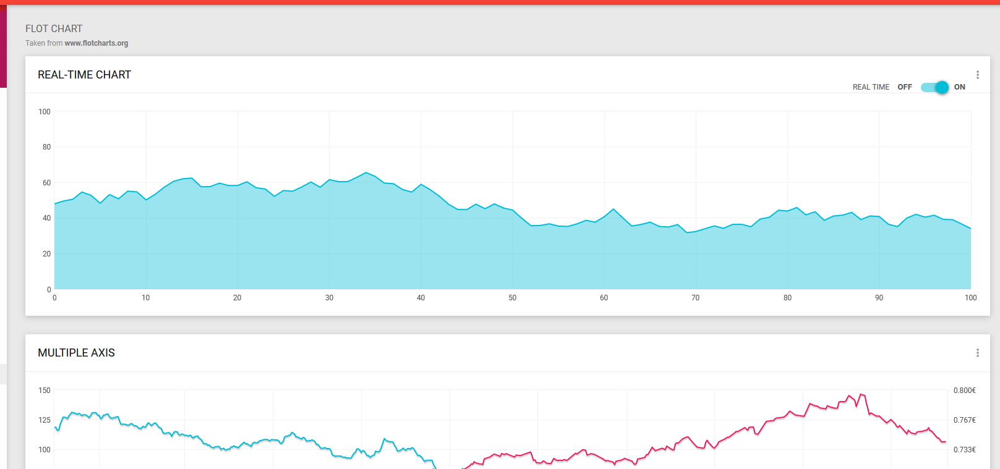
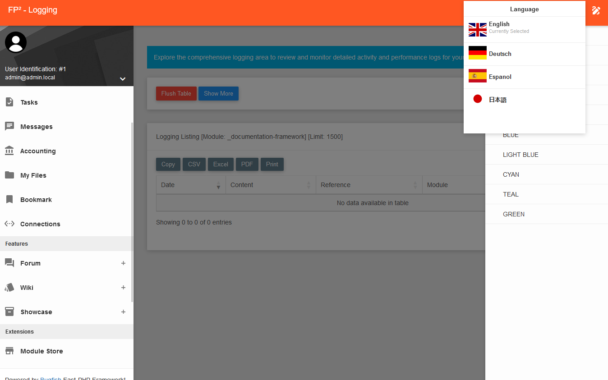
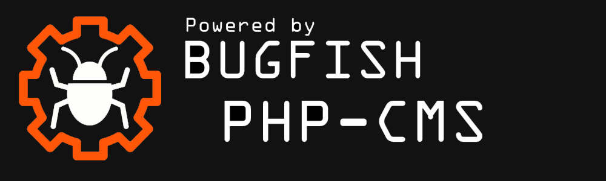

# bugfishCMS

## Introduction

bugfishCMS is a powerful and versatile content management system designed to empower both end-users and developers alike. Whether you're a business owner looking to streamline your online presence or a developer seeking robust backend functionalities, bugfishCMS has you covered.

With bugfishCMS, you can effortlessly manage user permissions, debug your websites for optimal performance, and customize the administrator interface to suit your preferences. Enjoy multi-language support, dynamic color schemes, and a simplified installation process with our intuitive GUI installer.

For developers, bugfishCMS offers a comprehensive suite of backend features, including multi-site management, framework integration, debugging tools, and dynamic code loading capabilities. Seamlessly integrate with our Bugfish Framework and leverage ready-to-use updater routines for effortless project maintenance.

Explore our extension store for additional functionalities, manage files and media assets with ease, and harness integrated CRM tools.

## Screenshots
Here you can find some screenshots about this project!

 

## Project Goal

Our primary goal with this project is to expedite and enhance multi-site deployment. Recognizing the paramount importance of swiftly launching web projects, we are committed to delivering a cutting-edge web hosting solution. We are in the process of implementing these advanced technologies into a new hosting panel, poised to redefine the web hosting landscape. Join us on this thrilling journey as we work towards reshaping web hosting as we know it.

## Promote us!

You want to support our project? Add or "powered by" images to your website and let users see that you are using our CMS!

